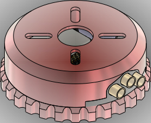
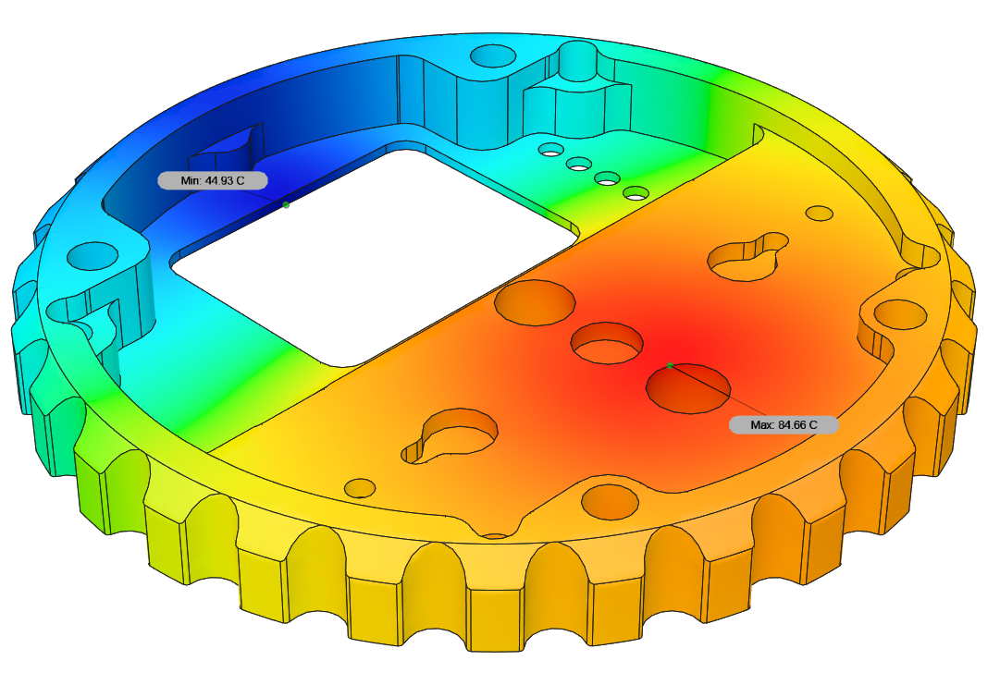
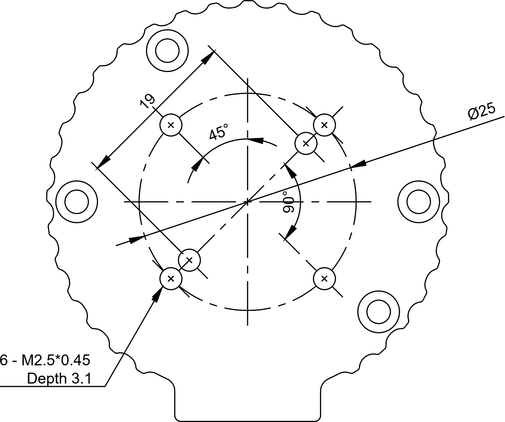

# Zubax Komar

Zubax Komar is a high-quality FOC ESC based on [Telega](https://zubax.com/technologies/telega) motor control technology.
Komar is designed to support the propulsion systems of light unmanned aerial vehicles (UAVs), unmanned underwater vehicles (UUVs)
and unmanned surface vehicles (USVs). Komar is compatible with almost all PMSM and BLDC motors.
It is designed to be a part of an integrated drive but allows operation as a separate unit as well.
Komar is one of the reference designs for the [Mitochondrik LV](https://zubax.com/products/mitochondrik-lv) control module.

## Brief specs

* 12...51 V input voltage range (4...12S LiCoO2 battery).
* Up to 2500 W output power (with 12S LiCoO2 battery).
* Maximum continuous phase current amplitude 100 A.
* A software-controllable 5 V BEC.
* Built-in motor temperature sensor for enhanced self-diagnostics.
* Komar supports a rich set of communication interfaces:
  * Double redundant CAN bus interface.
  * USB Micro-B interface for control, management, and telemetry.
  * Industry-standard RC PWM input.
* Komar is built using highly reliable automotive-grade AEC-Q qualified components.
* Operating device temperature - -40..85 °C.
* Operating humidity - 0..100 %RH (Condensation not permitted).
* Weight - 96.5 g (cables not included).

Due to its superb efficiency Komar can operate at high power levels using only a very lightweight and compact heatsink to cool the device down.

Komar is designed to be a part of an integrated drive for mid-power motors.
It is best suited for the motors with following specs:

* Continuous power: 2.5 kW
* Continuous phase current amplitude: 90 A
* Outer diameter: 80 mm

Komar can also be used as a separate unit. In this case, a custom phase connector mounted on the housing may be used to provide motor connections.

## Construction and usage

Komar itself consists of a power stage PCB with Mitochondrik and the housing (aluminum enclosure plus several plastic parts).
The PCB may use several optional 3D-printed parts that don't influence its properties directly, but may improve the overall user experience:

- Lightpipe
- Capacitor support

## Connections and indication

All connections (except the phase connector) and indicators are presented on the bottom cover, as shown in figure below.

Pinout of connectors is presented in the tables below. 

### CAN1 & CAN2 connectors (type JST BM04B-GHS)

| Pin # | Type  | Name  | Comments                                        |
|-------|-------|-------|-------------------------------------------------|
| 1     | Power | PWR   | BEC 5V power output. Activated in the firmware. |
| 2     | I/O   | CAN_H |                                                 |
| 3     | I/O   | CAN_L |                                                 |
| 4     | Power | GND   |                                                 |

The device does not terminate the CAN bus internally.
If the bus is not redundant, only CAN1 (the primary CAN bus interface) can be used.

### AUX connector (type JST BM04B-GHS)

| Pin # | Type  | Name  | Comments                          |
|-------|-------|-------|-----------------------------------|
| 1     | Power | PWR   | 5V line output                    |
| 2     | I/O   | GPIO1 | GPIO/RCPWM input/Thermistor input |
| 3     | I/O   | GPIO2 |                                   |
| 4     | Power | GND   |                                   |

The motor windings temperature can be measured by means of a PTC thermistor. The following thermistors can be connected between GPIO1 and GND:

- KTY84/130
- KTY81/120
- KTY83/120

No additional components are needed for the thermistor. The thermistor model is selected in the firmware.

### USB connector

Common USB 2.0 Micro-USB connector is dedicated for the device configuration and control using the [Kucher GUI](https://files.zubax.com/products/com.zubax.kucher/1.0.0/).

## Thermal performance

Thermal simulation is performed under the following conditions:

* The heat source is applied to the heatsink area where the PCB is placed. Its power is 78.5 W.
  It is a typical value of power losses in the Komar power stage when operating at a power level of 2500 W
  and powered from a discharged 12S battery (~40 V). This should represent the worst-case scenario.

* Ambient temperature is 20 °C.

* The convection value of 350 W/(m2K) is established empirically after conducting several experiments with real hardware.

## Mounting pattern

Please refer to the manufacturing manual and schematics for further information.
The most up-to-date documentation is attached to the latest published
[release package](https://github.com/Zubax/Komar/releases).

## Release notes

Newest entries at the top.

### Komar V1.3 (November 2022)

* Added alternative parts:
| Part | Alternative |
| ----------- | ----------- |
| ATA6561-GBQW-N | TJA1441DTK/0Z |
| BAV99HDWQ-13 | BAV70HDWQ-13 |
| FDMS86368-F085 | BSC080N12LSGATMA1 |
| MCP9700AT-E/TTVAO | MCP9701T-E/TT |
| ELXZ630ELL331MK20S | EEU-FC1J331B |
| NRVB120VLSFT1G | NRVB230LSFT1G |

### Komar V1.2 (July 2021)

* USB connector with mounting pads swaped with through-hole USB connector to ensure durability.
* Manufacturing instructions update.
* New design of the phase connector.
* Phase connector manufacturing instructions and jig added.
* A better design of the PCB spacer added.

### Komar V1.1 (August 2020)

* Panel template fix: solder mask issue with phase connectors pads fixed (#13).
* Enclosure: increase chamfering depth (#14).

### Komar V1.0 (July 2020)

#### Major PCB updates

* All components are AEC-Q qualified to be compatible with the hardware design policies.
* Better and bigger bulk capacitors.
* Holes for adding 3D-printed capacitor supports added; capacitor supports  developed (not shown on the PCB).
* All the gate networks re-routed and greatly improved.
* All the LEDs grouped in one place; holes for mounting lightpipe added.
* Holes diameter for power supply wires soldering greatly increased to fit any 3.3 sqmm multi-stand wire.
* Holes diameter for phase wires increased to fit either any 2 sqmm multi-stand wire
  (in the case of motor soldering to the PCB) or 3.3 sqmm single-strand wire (if phase connectors are used).
* Overcurrent protection trip level increased 1.5 times to theoretical value of 200 A.
  In practice, however, the overcurrent protection tends to trip at approx. 20-30% below the configured level
  due to the temperature drift of the MOSFETs RDS(on) and RF noise.
* TVS diodes with a lower reverse standoff voltage are used (51 V).

#### Major housing changes

* The housing parts are now held together with 4 M3.5 screws instead of M3.
* The housing itself is now mounted on the chassis using 4x M4 screws (was M3).
* Wall thickness of the top part of the housing increased from 1 to 1.6 mm.
* The connector window is slightly smaller now.
* A totally different construction of the phase connector.
  It is much bigger and accepts bullet connectors up to 6 mm (previously, 3.5 mm bullet connectors were used).
* Phase connector is now supposed to use single-stranded thick stiff copper wires instead of flexible multi-stranded ones.
* All the LEDs are grouped in one place now. The holes for the LEDs have been moved.
* Lightpipe for the LEDs added (will be manufactured inhouse using 3d printing).
* 3D-printed spacers between the PCB and the housing added.
* Slightly improved the heatsink efficiency by redesigning the fins.
* 3x M2.5 holes for mounting optional (and not yet developed) connector protection cap added.
* Optional power connector assembly  mount added.

### Komar V0.2 (2018)

First release that was actually manufactured.

### License

This project is licensed under the terms of [CC-BY 4.0](https://creativecommons.org/licenses/by/4.0/).
