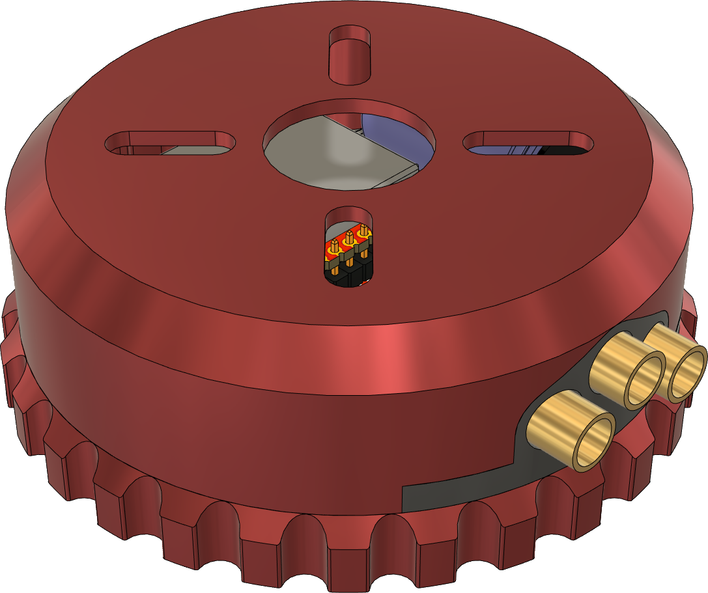
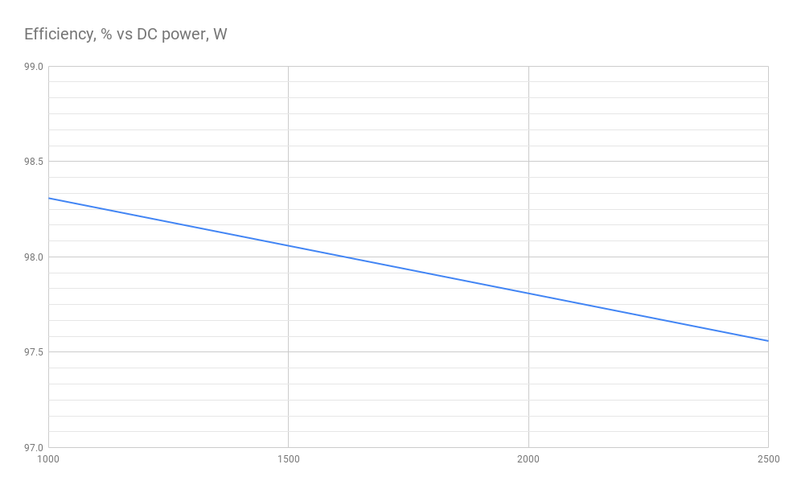

# Zubax Komar

## Overview

Zubax Komar is a high-quality FOC ESC based on [Telega](https://zubax.com/technologies/telega) motor control technology. Komar is designed to support the propulsion systems of light unmanned aerial vehicles (UAVs), unmanned underwater vehicles (UUVs) and unmanned surface vehicles (USVs). Komar is compatible with almost all PMSM and BLDC motors and can optimize motor performance by automatically calibrating the motor parameters. It is designed to be a part of an integrated drive but allows operation as a separate unit as well. Komar is one of the reference designs for the [Mitochondrik LV](https://zubax.com/products/mitochondrik-lv) control module.

  

## Brief specs

* 13 - 51 V input voltage range (4 - 12S LiCoO2 battery).
* Up to 2500 W output power (in the whole voltage range of 12S LiCoO2 battery).
* Maximum phase current 100 A. 
*  A software-controllable 5 V, 0.5 A BEC.
*  Built-in motor temperature sensor for enhanced self-diagnostics.
* Komar supports a rich set of communication interfaces:
  * Double redundant CAN bus interface
  * USB Micro-B interface for control, management, and telemetry
  * Industry-standard RC PWM input

* Komar is manufactured using highly reliable automotive grade AEC-Q qualified components.

  

Due to its superb efficiency Komar can operate at high power levels using only a very lightweight and compact heatsink to cool the device down. 

Komar is designed to be a part of an integrated drive for mid-power motors. It is best suited for the motors with following specs:

* Power level: 1.5 - 2.5 kW
* Current: 50 - 80 A
* Diameter 60 - 80 mm
* KV > 180 (assuming 12S battery is used)

Despite that Komar still can be used as a separate unit. In this case a custom phase connector mounted on the housing may be used to provide motor connections. 

## Construction and usage

Komar itself consists of a power stage PCB with mitochondrik and an aluminum housing (and one or two plastic parts). 

 
The housing is kept together using 4 M3 screws. Komar mounting is performed using 4 M3 screws too. For mounting a motor to the top part of the housing M3 or M4 screws may be used. 

## License

This project is licensed under the terms of [CC-BY 4.0](https://creativecommons.org/licenses/by/4.0/).

