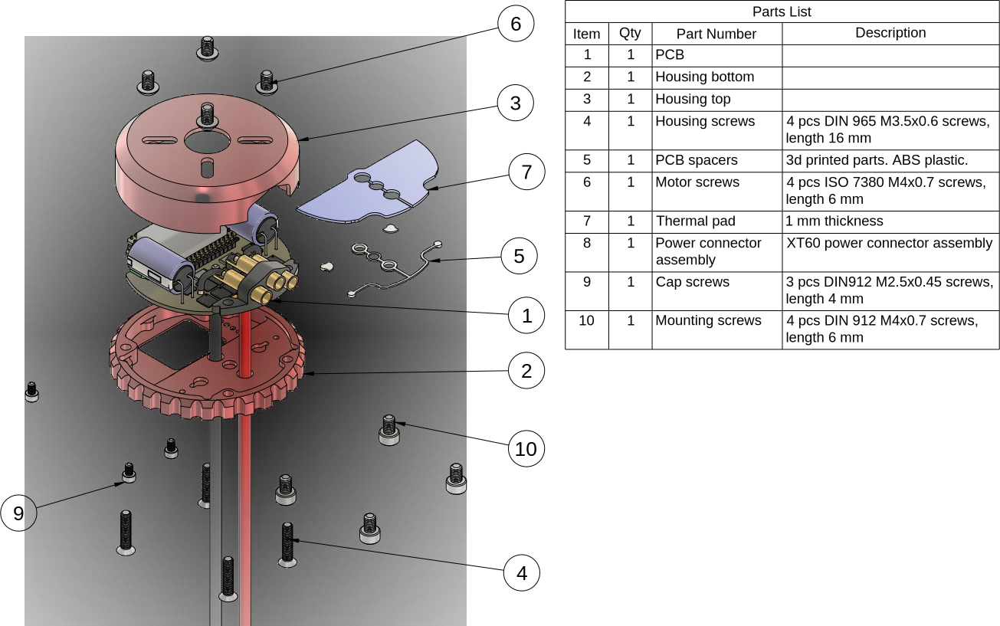

# Zubax Komar

## Overview

Zubax Komar is a high-quality FOC ESC based on [Telega](https://zubax.com/technologies/telega) motor control technology. Komar is designed to support the propulsion systems of light unmanned aerial vehicles (UAVs), unmanned underwater vehicles (UUVs) and unmanned surface vehicles (USVs). Komar is compatible with almost all PMSM and BLDC motors and can optimize motor performance by automatically calibrating the motor parameters. It is designed to be a part of an integrated drive but allows operation as a separate unit as well. Komar is one of the reference designs for the [Mitochondrik LV](https://zubax.com/products/mitochondrik-lv) control module.

## Brief specs

* 12...51 V input voltage range (4 - 12S LiCoO2 battery).
* Up to 2500 W output power (in the whole voltage range of 12S LiCoO2 battery).
* Maximum continuous phase current amplitude - 100 A.
* A software-controllable 5 V BEC.
*  Built-in motor temperature sensor for enhanced self-diagnostics.
* Komar supports a rich set of communication interfaces:
  * Double redundant CAN bus interface.
  * USB Micro-B interface for control, management, and telemetry.
  * Industry-standard RC PWM input.

* Komar is manufactured using highly reliable automotive grade AEC-Q qualified components.

  

Due to its superb efficiency Komar can operate at high power levels using only a very lightweight and compact heatsink to cool the device down. 

Komar is designed to be a part of an integrated drive for mid-power motors. It is best suited for the motors with following specs:

* Continuous power: 2.5 kW
* Continuous phase current amplitude: 90 A
* Outer diameter: 80 mm
* KV > 180 (assuming 12S battery is used)

Komar can also be used as a separate unit. In this case, a custom phase connector mounted on the housing may be used to provide motor connections.

## Construction and usage

Komar itself consists of a power stage PCB with Mitochondrik and an aluminum housing (and several plastic parts). The PCB may use several optional 3d printed parts that don't influence its properties directly, but may improve the overall user experience.  The usage of these parts (lightpipe and cap_suport parts) may be omitted if the parts are considered unnecessary.  

### Komar PCB blow scheme

### Komar blow scheme

The housing is kept together with 4x M3.5 screws. Komar is mounted using 4x M4 screws. The motor is mounted onto the top part of the housing with M4 button head screws (ISO 7380).

## Release notes

Newest entries at the top.

### Komar V1.0 (released in June 2020)

#### Major PCB updates

* Every component is replaced with its AEC-Q qualified substitute to be compatible with hardware development policies.
* Better and bigger bulk capacitors.
* Holes for adding 3d printed capacitor supports added; capacitor supports  developed (not shown in the pcb).
* All the gate networks re-routed and greatly improved.
* All the LEDs grouped in one place; holes for mounting lightpipe added.
* Holes diameter for power supply wires soldering greatly increased to fit any 12 AWG multi-stand wire.
* Holes diameter for phase wires increased to fit either any 14 AWG multi-stand wire (in the case of motor soldering to the PCB) or 12 AWG single-strand wire (in the case of using the phase connector).
* Overcurrent protection trip level increased 1.5 times to theoretical value of 200 A. In practice, however, overcurrent protection tends to trip at approx 20-30% lower current level due to themperature drift of the MOSFETs RDS(on) and RF noise. 
* TVS diodes replaced with ones with lower reverse standoff voltage (51 V).

#### Major housing changes

* Housing halves are now held together with 4 M3.5 screws instead of M3.
* Housing itself is now mounted on the chassis using 4 M4 screws (was M3).
* Wall thickness of the top part of the housing increased from 1 to 1.6 mm.
* Connector window is slightly smaller now.
* Totally different construction of the phase connector. It became much bigger and now should fit up to 6 mm bullet connectors (previously 3.5 mm bullet connectors were used).
* Phase connector is now supposed to use single stranded thick stiff copper wires instead of flexible multi-stranded ones.    
* All the LEDs are grouped in one place now. Holes for the LEDs moved.
* Lightpipe for the LEDs added (will be manufactured inhouse using 3d printing).
* 3D printed spacers between the PCB and the housing added. 
* Slightly improved heatsink efficiency by redesigning the fins.
* 3 M2.5 holes for mounting optional (and not yet developed) connector protection cap added
* Optional power connector assembly  mount added. 

### Komar V0.2 (released in 2018)

First release that was actually manufactured. 

### License

This project is licensed under the terms of [CC-BY 4.0](https://creativecommons.org/licenses/by/4.0/).
