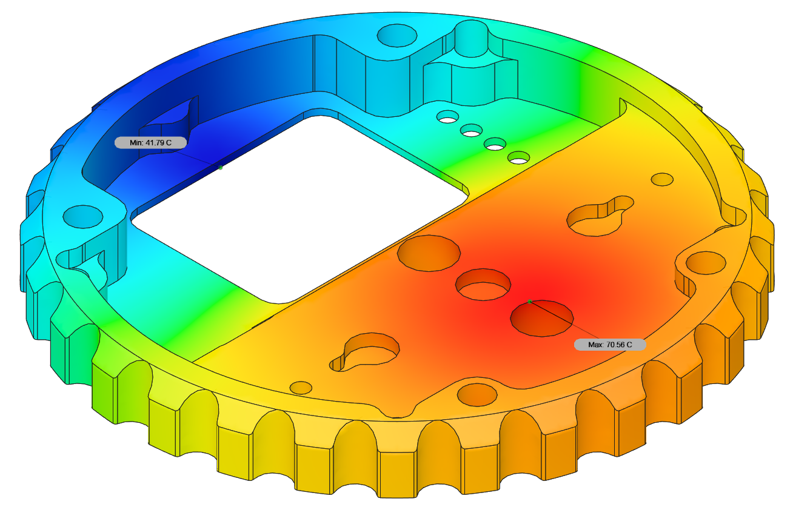

# Zubax Komar

Zubax Komar is a high-quality FOC ESC based on [Telega](https://zubax.com/technologies/telega) motor control technology.
Komar is designed to support the propulsion systems of light unmanned aerial vehicles (UAVs), unmanned underwater vehicles (UUVs)
and unmanned surface vehicles (USVs). Komar is compatible with almost all PMSM and BLDC motors.
It is designed to be a part of an integrated drive but allows operation as a separate unit as well.
Komar is one of the reference designs for the [Mitochondrik LV](https://zubax.com/products/mitochondrik-lv) control module.

## Brief specs

* 12...51 V input voltage range (4...12S LiCoO2 battery).
* Up to 2500 W output power (with 12S LiCoO2 battery).
* Maximum continuous phase current amplitude 100 A.
* A software-controllable 5 V BEC.
* Built-in motor temperature sensor for enhanced self-diagnostics.
* Komar supports a rich set of communication interfaces:
  * Double redundant CAN bus interface.
  * USB Micro-B interface for control, management, and telemetry.
  * Industry-standard RC PWM input.
* Komar is built using highly reliable automotive-grade AEC-Q qualified components.

Due to its superb efficiency Komar can operate at high power levels using only a very lightweight and compact heatsink to cool the device down.

Komar is designed to be a part of an integrated drive for mid-power motors.
It is best suited for the motors with following specs:

* Continuous power: 2.5 kW
* Continuous phase current amplitude: 90 A
* Outer diameter: 80 mm
* KV > 180 (assuming 12S battery is used)

Komar can also be used as a separate unit. In this case, a custom phase connector mounted on the housing may be used to provide motor connections.

## Construction and usage

Komar itself consists of a power stage PCB with Mitochondrik and the housing (aluminum enclosure plus several plastic parts).
The PCB may use several optional 3D-printed parts that don't influence its properties directly, but may improve the overall user experience:

- Lightpipe
- Capacitor support

Please refer to the manufacturing manual for further information.

## Thermal performance

Thermal simulation is performed under following conditions:

* The heat source is applied to the heatsink area where the PCB is placed. Its power is 78.5 W.
It is a typical value of power losses in the Komar power stage when operating at a power level of 2500 W
and powered from a discharged 12S battery (~40 V). This should represent the worst-case scenario.

* Ambient temperature is 20 °C

* Convection value of 350 is defined empirically after conducting several experiments with actual hardware.
It may be considered a moderate convection estimation as during the laboratory testing the device mounting point was suboptimal.

  

  
  

## Release notes

Newest entries at the top.

### Komar V1.0 (July 2020)

#### Major PCB updates

* All components are AEC-Q qualified to be compatible with the hardware design policies.
* Better and bigger bulk capacitors.
* Holes for adding 3D-printed capacitor supports added; capacitor supports  developed (not shown on the PCB).
* All the gate networks re-routed and greatly improved.
* All the LEDs grouped in one place; holes for mounting lightpipe added.
* Holes diameter for power supply wires soldering greatly increased to fit any 3.3 sqmm multi-stand wire.
* Holes diameter for phase wires increased to fit either any 2 sqmm multi-stand wire
(in the case of motor soldering to the PCB) or 3.3 sqmm single-strand wire (if phase connectors are used).
* Overcurrent protection trip level increased 1.5 times to theoretical value of 200 A.
In practice, however, overcurrent protection tends to trip at approx 20-30% lower current level due to themperature drift of the MOSFETs RDS(on) and RF noise.
* TVS diodes with a lower reverse standoff voltage are used (51 V).

#### Major housing changes

* The housing parts are now held together with 4 M3.5 screws instead of M3.
* The housing itself is now mounted on the chassis using 4x M4 screws (was M3).
* Wall thickness of the top part of the housing increased from 1 to 1.6 mm.
* The connector window is slightly smaller now.
* Totally different construction of the phase connector.
It became much bigger and now should fit up to 6 mm bullet connectors (previously 3.5 mm bullet connectors were used).
* Phase connector is now supposed to use single-stranded thick stiff copper wires instead of flexible multi-stranded ones.
* All the LEDs are grouped in one place now. The holes for the LEDs have been moved.
* Lightpipe for the LEDs added (will be manufactured inhouse using 3d printing).
* 3D-printed spacers between the PCB and the housing added.
* Slightly improved the heatsink efficiency by redesigning the fins.
* 3x M2.5 holes for mounting optional (and not yet developed) connector protection cap added.
* Optional power connector assembly  mount added.

### Komar V0.2 (2018)

First release that was actually manufactured.

### License

This project is licensed under the terms of [CC-BY 4.0](https://creativecommons.org/licenses/by/4.0/).
