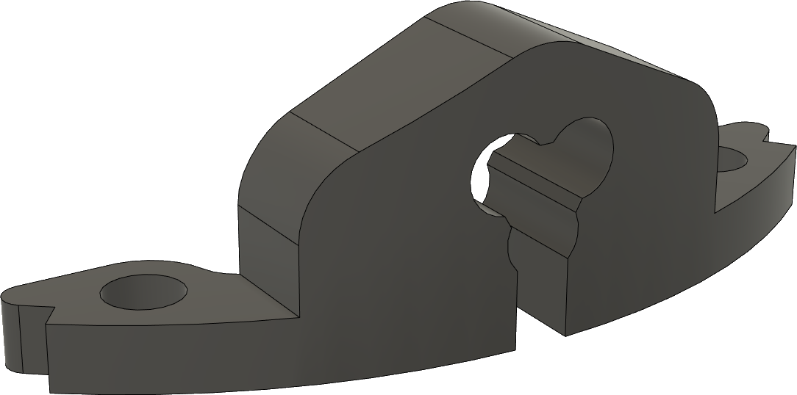
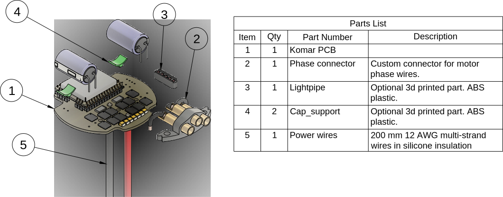

# Zubax Komar power stage manufacturing instructions

The manufacturing documentation package contains the following entities:

* Gerber files.
* Assembly drawings (in PDF format) and centroid files.
* BOM spreadsheet.
* PCB stack specification exported from the EDA.
* This document.
* Manufacturing documentation for the sub-assemblies:
  * Rigid phase connector assembly.

## Components

### PCB

The PCB is 4-layer with 35 um copper on all layers.
Its dimensions is a circle with a diameter of 58 mm.
The total PCB thickness is 1.6±0.1 mm.
The solder mask color should be red, silkscreen color -- white.

The copper layers are ordered as follows:

1. copper_top_l1
2. copper_inner_l2
3. copper_inner_l3
4. copper_bottom_l4

### Custom plastic parts

Several 3D-printed plastic parts are needed for the assembly:

- Motor phase wires interface
- PCB spacers

The parts should be printed using a generic FDM 3D printer using ABS filament.
The recommended settings are as follows:

* Nozzle diameter: 0.3-0.4 mm
* Layer width: 0.36-0.44 mm
* Layer height: 0.1 mm

### Thermal pad

The thermal pad serves as thermal interface between the PCB and the housing.
The thermal pad has a relatively complex shape, some kind of jig may be used to cut it in a repeatedly and easy way.
Use the picture below as a reference.
The detailed thermal pad drawing can be exported from the 3d model of the device.

### Bill of materials

PCB assembly not included. Solder and consumables not included.

Item                          | Amount| Part number                                                     | Description
------------------------------|-------|-----------------------------------------------------------------|-------------------------------------------------------
Silicone glue                 | ~3 ml | Penosil 2121                                                    | Used for fixing two bulk aluminum capacitors.
Conformal coating             | ~3 ml | Taerosol PRF 202                                                | Fast-curing protective coating.
Phase connector               | 0/1   | (see enclosed assembly documentation)                           | 3D-printed. Used with **option #1 motor phase wires interface.**
Phase wires inlet                   | 0/1   |                                                                 | 3D-printed. Used with **option #2 motor phase wires interface.**
Positive wire                 | 1     | Copper 2.5 mm2 multi-strand silicone/PVC red 105 °C  | Positive power wire.
Negative wire                 | 1     | Copper 2.5 mm2 multi-strand silicone/PVC black 105 °C| Negative power wire.
Housing top                   | 1     |                                                                 | Milled from aluminum.
Housing bottom                | 1     |                                                                 | Milled from aluminum.
Housing screws                | 4     | DIN 965 M3.5 16 mm                                              | Fastening both parts of the housing together.
Motor screws                  | 4     | ISO 7380 M4 6 mm                                                | Fastening the motor to the top part of the housing.
Mounting screws               | 4     | DIN 912 M4 6 mm                                                 | Fastening the assembled Komar in place.
Connector protection cap screws | 0/3 | DIN912 M2.5 4 mm                                                | Fastening the connector protection cap against the bottom.
PCB spacers                   | 1 set |                                                                 | 3D-printed.
Connector protection cap      | 0/1   |                                                                 | 3D-printed, optional.
Capacitor support             | 0/2   |                                                                 | 3D-printed, optional.
Lightpipe                     | 0/1   |                                                                 | 3D-printed, optional.
Thermal pad                   | 60x30 mm | Arctic Cooling ACTPD00018A, ACTPD00005A, or ACTPD00002A      | Sinks the heat to the bottom part of the housing.

## Assembly

### 1. SMD assembly

### 2. Mitochondrik mounting

Prior to mounting the Mitochondrik,
the PLS2 pin headers (CON100, CON101, CON102, CON103, CON104, CON105) should be soldered to the PCB.
The Mitochondrik is inserted on top of these headers and soldered.

### 3. Capacitor soldering

The C1 and C2 radial electrolytic caps should be soldered sideways as shown in picture below.
Ensure the correct polarity.

The capacitors should be glued to the PCB with a non-conductive silicone glue
(see the BOM table below for the recommended partnumber).

### 4. Power wires soldering

The ends that are not soldered to the PCB should be stripped and tinned (approx. 5 mm).
The wires should be soldered as shown in the pictures below.

### 5. Motor phase interface assembly

The motor phase interface can be assembled in one of the configurations described in this section.

#### Option #1. Rigid phase connector

The phase connector is shown in the picture below.
The guide for low-volume production is available in the adjacent document.

It should be soldered to the PCB so that the bottom surface of the plastic part rests on the PCB:

#### Option #2. Fixed motor attachment

The motor is installed onto the top part of the enclosure.

The motor phase wires are routed inside the enclosure through a 3d printed cable inlet, cut to the appropriate length,
and then soldered to the PCB.
The cable inlet can be seen on the picture below.
It is fixed on the top part of the housing in a similar way to the rigid phase connector.
Minor modifications of the cable inlet may be necessary depending on the particular motor phase wires' thickness.

The motor and its parts, if any, are not part of the bill of materials.

### 6. Conformal coating

The PCB should be conformal-coated (see the BOM table below for the recommended partnumber),
excluding the connectors on the bottom side of the PCB (CON1, CON3, CON4, CON5, CON6, CON7)
and the inner surfaces of the phase connectors.

### 7. Housing assembly

The finished PCB assembly is shown below for reference:

The assembly is placed inside the housing:

For the detailed instructions please watch the video:

