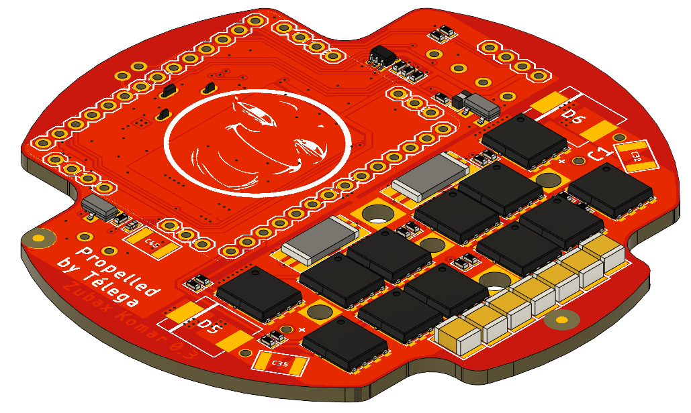
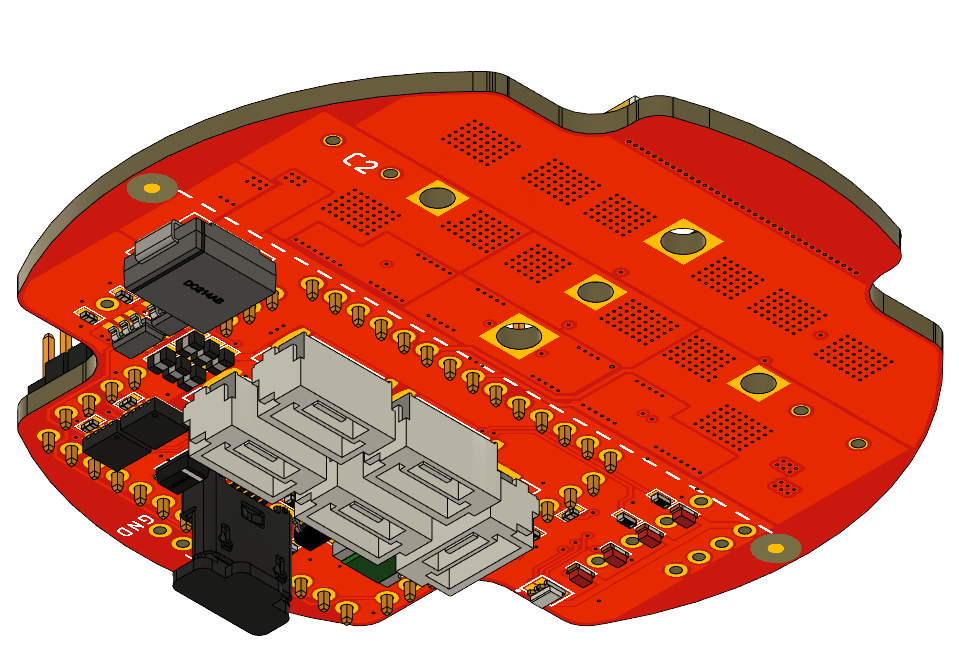
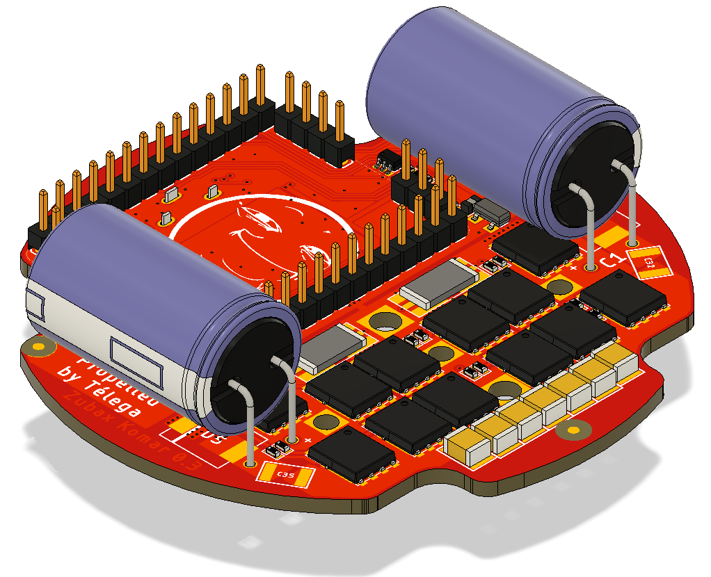
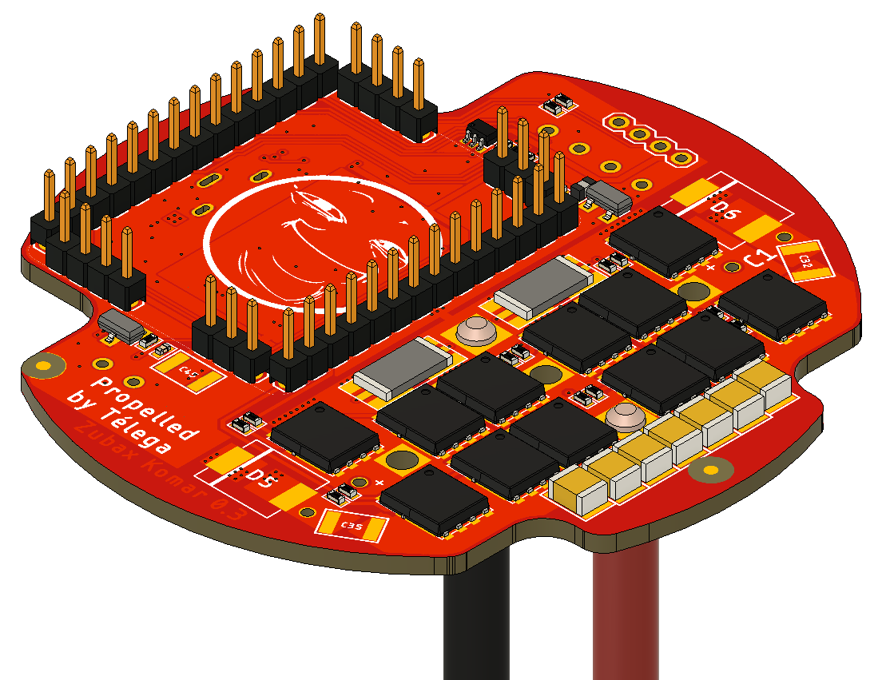
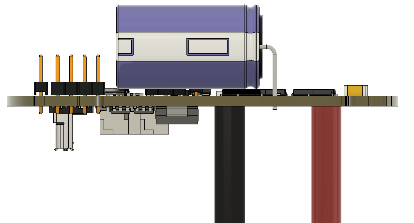

## Zubax Komar power stage manufacturing instructions

The manufacturing documents package can be found attached to the releases in this repository. It contains following entities:

* Gerber - all the necessary gerber files are contained here.
* Assembly - assembly drawings (in PDF format) and centroid files are contained here.
* BOM - a bill of materials in a form of spreadsheet.
* PCB stack - a file containing description of the PCB stack and layers.
* Wires drawing.

It should be noted that Komar is a highly reliable device and consists of AEC-Q qualified components, thus any changes to BOM are **highly undesirable**.

The device assembly involves soldering wires. Considering that Digikey has a very limited choice of wires and the overall impracticality of the idea of buying wires on Digikey it is recommended to source the wires from local suppliers. The criteria are:

* Wire material - copper
* Wire type - multi stranded
* AWG (12 and 14 AWG are used in the design)
* Color (red and black are used in the design)
* Insulation material (silicone is highly recommended for its outstanding thermal resistance, although PVC may be used as well)

PCB properties:

The PCB is 4 layer PCB with 35 um copper on all layers. Its dimensions is a circle with a diameter of 58 mm. PCB Total
 thickness is 1.58 - 1.6 mm. Solder Mask color should be red, silkscreen color - white. 

Copper layer order is:

1. copper_top_l1

2. copper_inner_l2

3. copper_inner_l3

4. copper_bottom_l4

   

## Assembly

There are several steps to assemble the PCB:

1. **SMD assembly**. After SMD assembly the board should look like this:

   

 

2. **Capacitors and pin headers soldering**.

   C1 and C2 radial electrolytic should be soldered sideways as in picture below. **Observe the polarity!**

   

   3. **Wires soldering.** There are total 5 wires to be soldered to the PCB: 2 power supply wires (20 cm long each, one red and one black, 12 AWG cable) and 3 phase wires (20 cm long each, one red and one black, 14 AWG cable). Power supply wires’ ends that are not soldered to the PCB should be stripped and tinned (approx. 5 mm). Phase wires’ ends that are not soldered to the PCB should not be stripped. For better wires representation please refer to wires drawing in the manufacturing doc pack. The wires should be soldered as shown in the pictures below.

      **Phase wires:**

      

      **Power wires:**

      

      

4. **Conformal coating.** The PCBs should be covered with conformal coating entirely excluding pin headers on the top (CON100, CON101, CON102, CON103, CON104, CON105) and connectors on the bottom side of the PCB (CON1, CON3, CON4, CON5, CON6, CON7). 
