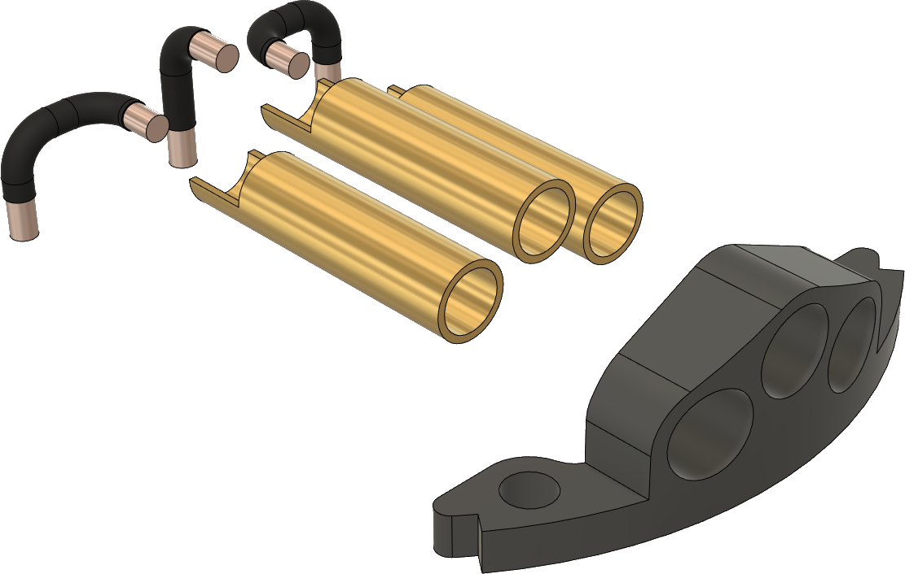
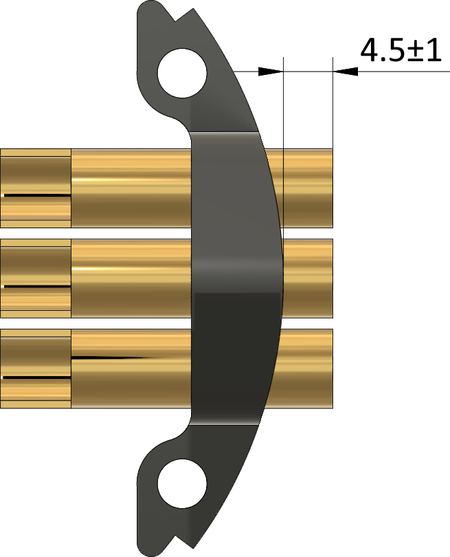

# Rigid phase connector

This is the manufacturing documentation for the rigid phase connector sub-assembly.

## Bill of materials

Item               | Amount | Description
-------------------|--------|-------------------------------------------------------------
Connector body     | 1      | 3D-printed
Bullet connector   | 3      | 4.5 mm diameter female bullet connector (the same type that is used in XT90 power connectors)
Wire               | 3×25 mm| 3 mm2 solid copper wire
Heat shrink tube   | 3×17 mm| Supplied diameter 1-1.5 mm
Epoxy glue         | ~3 g   | N/A

## Assembly

1) 3D print  the connector housing.
   Any generic FDM 3D-printer will do the job.
   No special settings needed.
   Support structures are optional.
   It may be needed to clear the holes for the bullet connectors with a 4.5 mm drill bit after the printing.

2) Solder the three pieces of wire to the bullet connectors.

3) Glue the bullet connectors to the housing. The connectors should be placed as shown in the picture below:

4) Form and trim the wires in place.

5) Place a piece of heat shrink tube on each wire so that it covers all the surface of the wire excluding
   approx. 2-3 mm on the side that is meant for soldering it to the PCB.
   The final result should be like this:

