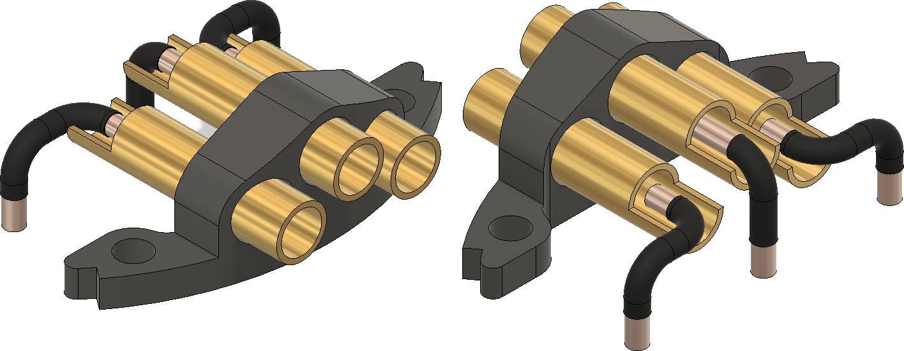

# Rigid phase connector

This is the manufacturing documentation for the rigid phase connector sub-assembly.

A special jig may be used to ease the process of manufacturing. 
The jig consists of two 3d-printed parts that are fastened together using two M3 x 30 mm screws.
The jig allows for precision connector's pins forming and installing 
the bullet connectors into the connector housing at the right depth.

## Bill of materials

Solder and consumables not included.

Item               | Amount | Description
-------------------|--------|-------------------------------------------------------------
Connector body     | 1      | 3D-printed
Bullet connector   | 3      | 4 mm diameter female bullet connector
Wire               | 3×25 mm| 3 mm2 solid copper wire
Heat shrink tube   | 3×17 mm| Supplied diameter 1-1.5 mm
Epoxy glue         | ~3 g   | N/A

## Assembly

1. 3D print  the connector housing.
   Any generic FDM 3D-printer will do the job.
   No special settings needed.
   Support structures are optional.
   It may be needed to clear the holes for the bullet connectors with a 4 mm drill bit after the printing.

2. Solder the three pieces of wire to the bullet connectors.

3. Form and trim the wires in place using the jig.

3.1 Due to wires' stiffness, it may be hard to form the side wires in place by hand.
To guarantee the wires' proper shape one should use the jig's additional features. 
For setting proper wire length the bullet connector should be pushed against the surface shown red in the picture below.
The wires should be trimmed so they are flush with the jig's bottom surface.

3.2. Then while keeping the other end of the wire flush with the bottom of the jig
the side bend can be done in the outer direction of the jig using the rounded surface shown red in the picture below.

 

3.2. Place the bullet connectors with pre-soldered wires into the jig as in the picture below. 

3.3. Remove the front part of the jig and the guiding M3 screws.

4. Apply some epoxy to the bullet connectors and then slip the phase connector housing on the bullet connectors
as far as it can go.

5. After the epoxy cures the connector can be removed from the jig by pulling it up.

6. Place a piece of heat shrink tube on each wire so that it covers all the surface of the wire excluding
   approx. 2-3 mm on the side that is meant for soldering it to the PCB.
   The final result should be like this:

